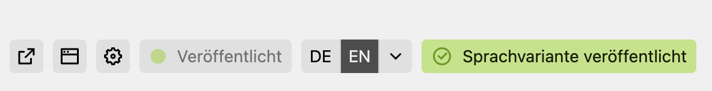

# Kirby Language Release

[](https://github.com/nerdcel/kirby-languagerelease/releases)
[](https://getkirby.com)
[](https://www.php.net/)
[](LICENSE)

A Kirby CMS plugin that provides granular control over language variant releases with frontend access control and preview capabilities.



## ⚠️ Important Warning

**This plugin changes the behavior of your multilingual site immediately after installation!**

Once installed, **all language variants (except the default language) will become inaccessible in the frontend** until they are explicitly released through the Panel. This prevents visitors from accessing unfinished translations.

**Before installing:**
- Back up your site
- Review your current language variants
- Plan which languages should be released immediately after installation

Editors can still access and preview all language variants through the Panel, regardless of their release status.

## Features

- ✅ **Release Control**: Individual release status for each language variant of a page
- ✅ **Frontend Access Control**: Unreleased variants are blocked from public access
- ✅ **Preview Mode**: Authenticated editors can preview unreleased variants via Panel
- ✅ **Flexible Behavior**: Choose between 404, redirect, or default content for unreleased pages
- ✅ **Token Validation**: Secure preview mode with session-based authentication
- ✅ **Multilingual Interface**: Translations for DE, EN, ES, FR, IT, NL
- ✅ **Configurable Field Name**: Use custom field names for the release status
- ✅ **Panel Integration**: ViewButton with checkbox interface

## Requirements

- **Kirby CMS**: 5.0 or higher
- **PHP**: 8.2 or higher

## Installation

### Via Composer (recommended)

```bash
composer require nerdcel/kirby-languagerelease
```

### Manual Installation

1. Download the [latest release](https://github.com/nerdcel/kirby-languagerelease/releases)
2. Extract the ZIP file
3. Copy the `languagerelease` folder to `/site/plugins/`

### Git Submodule

```bash
git submodule add https://github.com/nerdcel/kirby-languagerelease.git site/plugins/languagerelease
```

## Quick Start

### 1. Add Field to Your Blueprints (optional)

Add the release field to your page blueprints:

```yaml
fields:
  languageReleased:
    type: toggle
    label: Language Released
    default: false
```

### 2. Configure Plugin (Optional)

Create or update `site/config/config.php`:

```php
return [
    'nerdcel.languagerelease' => [
        'autoIncludeButton' => true,
        'fieldName' => 'languageReleased', // Field name in your blueprint
        'behavior' => '404', // What to do with unreleased pages: '404', 'redirect', 'default-content'
    ],
];
```

### 3. Release Language Variants

In the Panel, open a page and switch to a non-default language. You'll see a button to release that language variant in the upper right area next to the language select button.

## Configuration Options

### Field Name

Define which field stores the release status:

```php
'nerdcel.languagerelease.fieldName' => 'languageReleased'
```

### Behavior for Unreleased Pages

Choose what happens when visitors try to access unreleased language variants:

#### Option 1: 404 (Default, Recommended)

```php
'nerdcel.languagerelease.behavior' => '404'
```

Shows a 404 error page. Best for SEO and clear communication to search engines.

#### Option 2: Redirect

```php
'nerdcel.languagerelease.behavior' => 'redirect'
```

Redirects to the default language (302 redirect). User-friendly but may confuse search engines.

#### Option 3: Default Content

```php
'nerdcel.languagerelease.behavior' => 'default-content'
```

Displays content from the default language while keeping the URL. May cause duplicate content issues.

### Environment-Specific Configuration

```php
'nerdcel.languagerelease' => [
    'autoIncludeButton' => true,
    'fieldName' => 'languageReleased',
    'behavior' => match (option('environment')) {
        'production' => '404',
        'staging' => 'redirect',
        default => 'default-content',
    },
],
```

## How It Works

### Frontend Access Control

```
Visitor requests: example.com/en/page
                        ↓
              Is language released?
                        ↓
        ┌───────────────┴───────────────┐
        ↓                               ↓
      YES ✅                          NO ❌
        ↓                               ↓
   Page displays                  Behavior option:
    normally                     404 / redirect / default
```

### Preview Mode (Panel)

Editors can preview unreleased pages through the Panel's preview button. The plugin validates preview tokens to ensure only authenticated users can access unreleased content.

**Preview URL Parameters:**
- `?_preview=true&_token=xxx`
- `?version=changes&_token=xxx`

The token is validated server-side, ensuring security.

### Panel Access

All language variants remain fully accessible in the Panel:
- ✅ View all languages
- ✅ Edit all languages
- ✅ Preview unreleased languages
- ✅ No restrictions for editors

## Usage in Templates

### Check Release Status

```php
// Check if current language is released
if (isLanguageReleased($page)) {
    echo 'This page is released';
}

// Filter for released pages only
$pages = $site->children()->filter(fn($p) => isLanguageReleased($p));
```

### Get Field Name

```php
$fieldName = languageReleaseFieldName();
// Returns: 'languageReleased' (or your custom field name)
```

## Helper Functions

The plugin provides two global helper functions:

### `languageReleaseFieldName(): string`

Returns the configured field name.

```php
$field = languageReleaseFieldName();
```

### `isLanguageReleased(Page $page): bool`

Checks if a page's current language variant is released.

```php
if (isLanguageReleased($page)) {
    // Language is released
}
```

### `isAuthenticatedPreview(): bool`

Checks if the current request is an authenticated preview.

```php
if (isAuthenticatedPreview()) {
    // User is previewing with valid user session
}
```

## Translations

The plugin includes translations for:

- 🇩🇪 German (de)
- 🇬🇧 English (en)
- 🇪🇸 Spanish (es)
- 🇫🇷 French (fr)
- 🇮🇹 Italian (it)
- 🇳🇱 Dutch (nl)

All Panel texts automatically display in the user's selected language.

## Security

- ✅ Preview tokens are validated server-side
- ✅ Only authenticated users can preview unreleased content
- ✅ Session-based authentication
- ✅ No bypass mechanisms for unauthenticated users

## Troubleshooting

### Issue: All language variants are blocked after installation

**Solution:** This is expected behavior. Release your language variants through the Panel:
1. Open a page
2. Switch to the language
3. Check the "Release Language Variant" checkbox

### Issue: Preview button doesn't work

**Solution:** Make sure you're logged into the Panel. The preview requires a valid session.

### Issue: 404 errors on released pages

**Solution:** Check that the field name in your configuration matches the field in your blueprints.

## Example Configurations

### Minimal Configuration (Uses Defaults)

```php
// No configuration needed - uses 'languageReleased' field and '404' behavior
```

### Custom Field Name

```php
return [
    'nerdcel.languagerelease' => [
        'autoIncludeButton' => true,
        'fieldName' => 'isPublished',
        'behavior' => '404',
    ],
];
```

### User-Friendly Redirects

```php
return [
    'nerdcel.languagerelease' => [
        'autoIncludeButton' => true,
        'fieldName' => 'languageReleased',
        'behavior' => 'redirect',
    ],
];
```

## Development

### Local Development

```bash
git clone https://github.com/nerdcel/kirby-languagerelease.git
cd kirby-languagerelease
```

### Testing

Test the plugin in your local Kirby installation:

1. Create a test blueprint with the `languageReleased` field (optional)
2. Set up multiple languages
3. Test frontend access with released/unreleased variants
4. Test preview mode through Panel

## Changelog

See [CHANGELOG.md](CHANGELOG.md) for version history.

## Contributing

Contributions are welcome! Please feel free to submit a Pull Request.

## License

MIT License - see [LICENSE](LICENSE) file for details.

## Credits

Developed by [Marcel Hieke](https://marcelhieke.com)

## Support

- **Issues**: [GitHub Issues](https://github.com/nerdcel/kirby-languagerelease/issues)
- **Discussions**: [GitHub Discussions](https://github.com/nerdcel/kirby-languagerelease/discussions)

---

Made with ❤️ for the Kirby CMS community

